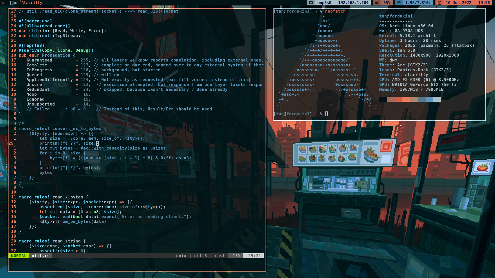

# Rice

## Screenshot


- Wallpaper: https://wallhaven.cc/w/6oez36

## Installation
``` shell
git clone --recursive https://github.com/tanaytekin/rice.git
cd rice
```

### Install DWM
``` shell
cd dwm
make
sudo make install
```

### Install dwmblocks
``` shell
cd dwmblocks
make
sudo make install
```

### Install scripts, dotfiles and wallpaper
``` shell
sudo cp scripts/* /usr/local/bin/
sudo cp wallpaper.png /usr/local/share/
cp -r .config ~/.config
cp .zshrc ~/
```
